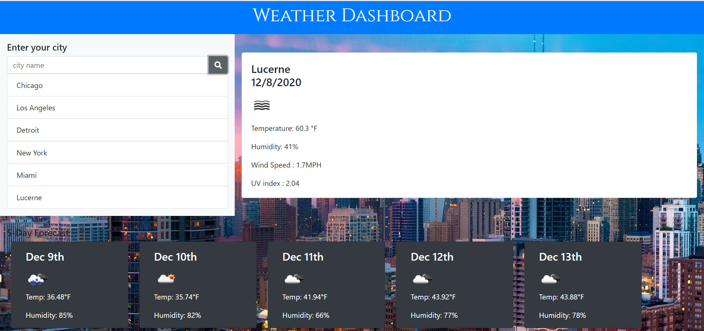

Matt's Weather Dashboard

<!-- Live link to deployed app -->
Repository: https://github.com/Mdudzik92/weatherapp  
Deployed app: https://mdudzik92.github.io/weatherapp/

<!-- Technologies used -->
HTML, CSS, JavaScript, AJAX, Server-Side API

<!-- Explanation of what the app is -->
This is an app which allows the user to search for the weather in their nearest city to get the current temperature, humidity, wind speed, and UV index. The user also gets an upcoming 5-day forecast for their chosen city. All they need to do is type their city and click the search button to give it a try!

<!-- Screenshot -->
 

<!-- License -->
MIT

<!-- Contact information -->
Email: mdudzik92@gmail.com